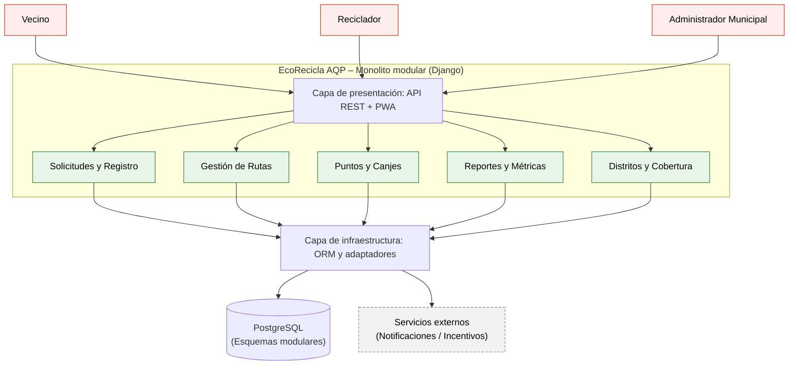

# EcoRecicla AQP – Laboratorio 04: Fundamentos de arquitectura de software
Construcción de Software - EPIS-UNSA - 2026-B - Grupo 03

## Integrantes

| Nombre | Rol en el laboratorio |
|---|---|
| Caceres Ruiz, Johann Andre | Redactor de Drivers y ADRs |
| Velarde Saldaña, Jhossep Fabritzio | Diagramador (Mermaid, PlantUML, Python Diagrams) |
| Coaquira Suyo, Gabriela Dayana | Verificador de IA y Bitácora |

## Caso

EcoRecicla AQP es una plataforma tecnológica para gestionar el recojo de residuos reciclables domiciliarios en coordinación con recicladores formalizados en distritos de Arequipa. Conecta a vecinos, recicladores en ruta y administradores municipales mediante solicitudes, generación de rutas de recojo, puntos canjeables y reportes de toneladas recicladas. El **atributo de calidad crítico** es la **modificabilidad**, exigiendo incorporar nuevos distritos o reglas de cálculo de puntos en $\le 2$ días-persona sin alterar los demás módulos.

## Arquitectura elegida (Monolito Modular)

## Decisiones arquitectónicas (ADR)

- [ADR-001: Estilo arquitectónico (Monolito Modular)](docs/architecture/adr/001-estilo-arquitectonico.md)
- [ADR-002: Estrategia de base de datos PostgreSQL](docs/architecture/adr/002-base-de-datos.md)
- [ADR-003: Autenticación con JWT](docs/architecture/adr/003-autenticacion.md)

## Reflexión sobre el uso de la IA (5-8 líneas)

La asistencia de IA fue de gran utilidad para estructurar rápidamente los escenarios de calidad de 6 partes, redactar borradores de ADR y proponer alternativas arquitectónicas iniciales. Sin embargo, se identificó que la IA tendía a sesgarse hacia microservicios hipercomplejos por "moda", ignorando las restricciones reales de 1 mes de plazo y 3 desarrolladores. Esto demostró la vigencia de la regla de oro: la IA propone, pero el equipo verifica críticamente, ajusta y valida cada decisión contra los drivers técnicos y presupuestarios del proyecto.
